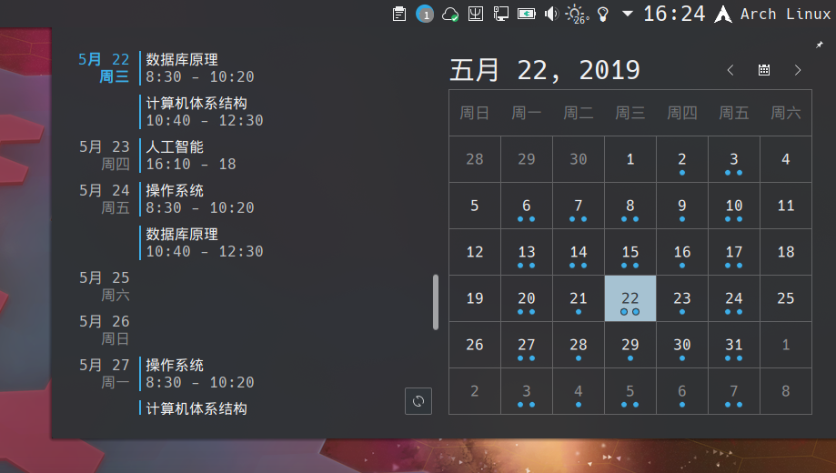
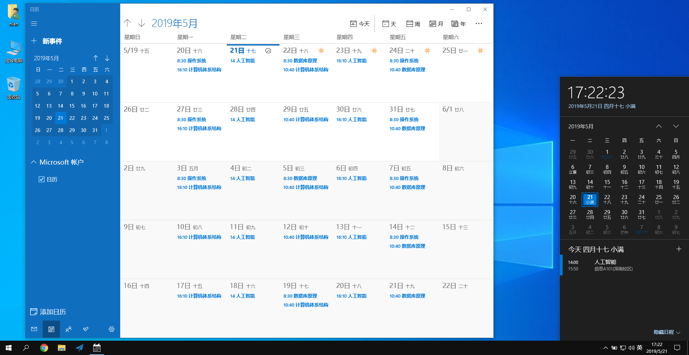
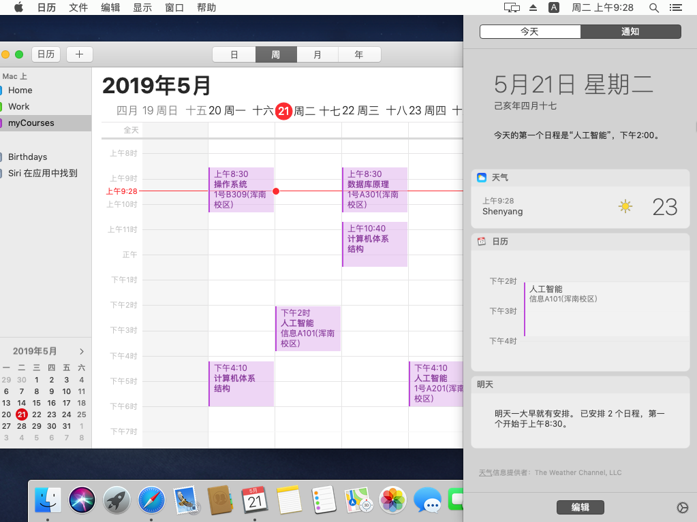

# getMyCourses
从NEU新版教务系统获取自己的课程表，并生成可导入日历的.ics文件。

## 使用方法
* 下载[Release](https://github.com/whoisnian/getMyCourses/releases/latest)后解压，在命令行环境下运行。
* 按提示通过树维教务系统或统一认证登录，程序自动抓取课程并在当前目录生成`myCourses.ics`。
* 打开.ics文件，系统会自动调用关联程序进行导入。

## 参考信息
* 通过树维教务系统登录获取课程表的具体请求过程：[NEU 新版教务处课程表.md](https://gist.github.com/whoisnian/32b832bd55978fefa042d7c76f9d76c3)
* iCalendar格式介绍：[维基百科：ICalendar](https://en.wikipedia.org/wiki/ICalendar)
* Google日历帮助：[创建或编辑ICAL文件](https://support.google.com/calendar/answer/37118#format_ical)

## 注意
* 生成.ics文件过程中会在命令行输出获取到的课程，请检查无误后再进行导入。
* 当前已测试可成功导入.ics文件的日历：Google 日历，Outlook 日历，Mac 系统日历，Win10 UWP 系统日历。
* Win10 UWP 日历缺少批量删除功能，可以关联 Outlook 帐户后使用 Outlook 帐户新建一个日历单独用于存储课程表。

## 效果图

